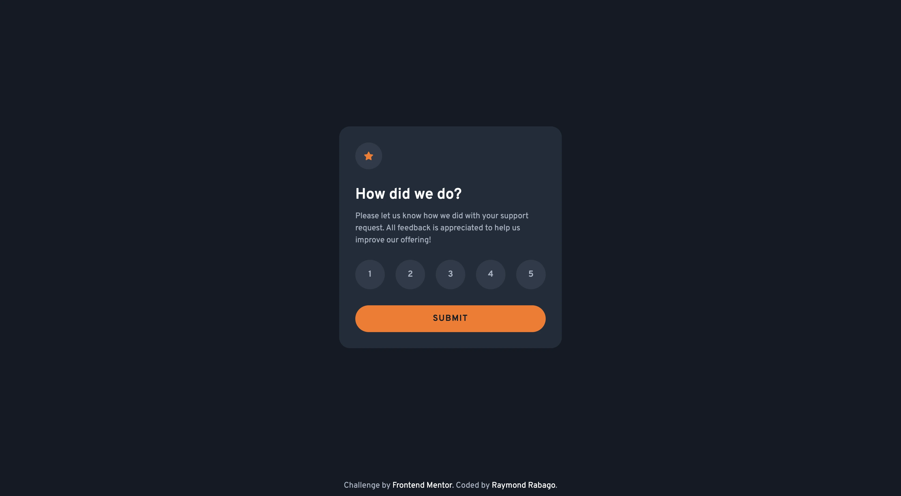
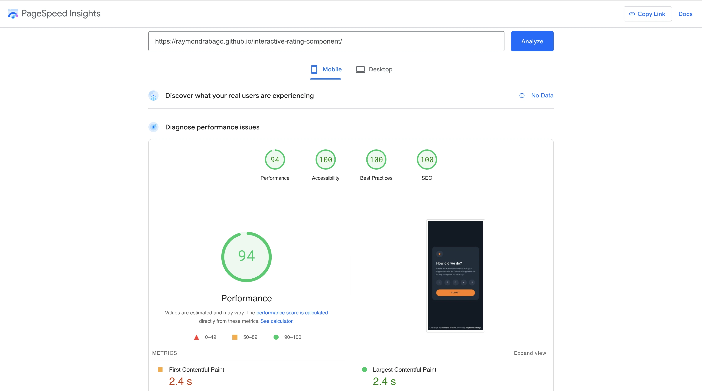
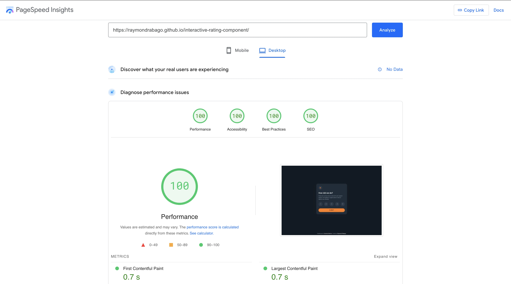

# Frontend Mentor - Interactive rating component solution

This is my way of coding for [Interactive rating component challenge on Frontend Mentor](https://www.frontendmentor.io/challenges/interactive-rating-component-koxpeBUmI). 



## Table of contents

- [Overview](#overview)
  - [The challenge](#the-challenge)
  - [Screenshot](#screenshot)
  - [Links](#links)
- [My process](#my-process)
  - [Built with](#built-with)
  - [What I learned](#what-i-learned)
- [Author](#author)

## Overview

Hello! This is my first coding challenge with Frontend Mentor, where I'm demonstrating my front-end skills in DOM manipulation, creating a mobile-responsive UI, enhancing accessibility, and optimizing page performance.

### The challenge

Users should be able to:

- View the optimal layout for the app depending on their device's screen size
- See hover states for all interactive elements on the page
- Select and submit a number rating
- See the "Thank you" card state after submitting a rating

### Screenshot
After solving the UI challenge, I also applied optimizations for accessibility and performance.



### Links

- Live Site URL: [https://raymondrabago.github.io/interactive-rating-component/](https://raymondrabago.github.io/interactive-rating-component/)
- Page Speed Performance: https://pagespeed.web.dev/analysis/https-raymondrabago-github-io-interactive-rating-component/uauawq8w1o?form_factor=mobile

## My process

Here is my thought process throughout the challenge:
- Reviewed the repetitive components (e.g., the form layout)
- Created generic components (e.g., form, radio buttons, and buttons)
- Designed micro-interactions for elements (e.g., hover, active, focus states)
- Implemented event triggers for radio fields and the submit button (e.g., validation, change rate, and hide/show thank-you message)
- Reviewed and applied page optimizations (e.g., performance, SEO, and accessibility)

### Built with
- Semantic HTML5 markup
- SASS
-- Flexbox
-- CSS Grid
- Vanilla JavaScript (ES6)
- Mobile-first workflow

### What I learned

I learned in this challenge how to use ```accesskey="{value}"``` to make the radio field keyboard-accessible.

Here is the implementation: 
```html
<input type="radio" id="rating-1" name="rating" value="1" aria-label="Rating 1" accesskey="1">
```

## Author

- Website - [Raymond Rabago](https://raymondrabago.github.io/)
- Frontend Mentor - [@RaymondRabago](https://www.frontendmentor.io/profile/RaymondRabago)


## Feedback

Feel free to send a PR or provide feedback. It would be much appreciated.


